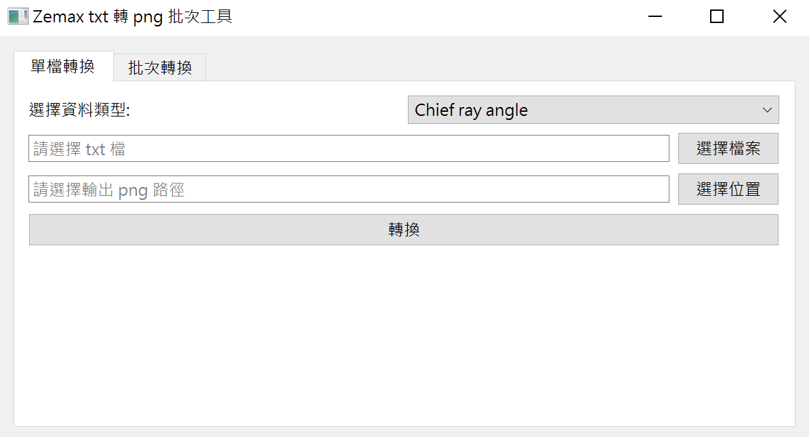

# zemax-txt2png-gui

## 專案簡介

本專案可將 Zemax 匯出的 txt 檔（如 Chief ray angle、Distortion、MTF、Through Focus、Relative Illumination 等）自動或批次轉換為 png 圖片。

支援 PySide6 圖形介面，亦可命令列批次處理。

---

## 主要功能

- 支援單檔/批次 txt 轉 png
- 支援多種 Zemax 輸出格式：
  - Chief ray angle
  - Distortion
  - MTF vs Field
  - MTF vs Frequency
  - Through Focus
  - Relative Illumination
- 圖形化操作介面（PySide6）
- 自動命名與輸出管理
- 自動預設輸出 png 路徑（與輸入 txt 同檔名）
- 轉換完成時跳出視窗提示

---

## 安裝所需套件

建議使用 Python 3.8 以上版本。

安裝必要套件：

```bash
pip install PySide6 matplotlib numpy
```

如需完整依賴，可建立 `requirements.txt`：

```
PySide6
matplotlib
numpy
```

---

## 檔案結構說明

```
Python_zemax_draw/
├── __config__.py                # 繪圖參數設定
├── batch_plot.py                # 命令列批次轉換主程式
├── gui_main.py                  # PySide6 圖形介面主程式
├── plot_cra.py                  # CRA 讀取與繪圖
├── plot_distortion.py           # Distortion 讀取與繪圖
├── plot_mtf_vs_field.py         # MTF vs Field 讀取與繪圖
├── plot_mtf_vs_lp.py            # MTF vs Frequency 讀取與繪圖
├── plot_RI.py                   # Relative Illumination 讀取與繪圖
├── plot_through_focus.py        # Through Focus 讀取與繪圖
├── input_zemax_textfile_folder/ # 放置待轉換的 txt 檔
├── output_meta-rosetta_pngfile_folder/ # 輸出 png 檔案資料夾
├── image/                       # 說明文件用圖片資料夾
│   ├── gui_interface.PNG        # GUI 介面截圖
│   └── icon.ico                 # 應用程式圖示
└── README.md
```

---

## Step by Step 操作說明

### 1. 圖形介面（GUI）操作

#### 介面預覽



如圖所示，GUI 分為單檔轉換與批次轉換兩個分頁，操作簡單直覺。

1. **啟動 GUI**

    ```bash
    python gui_main.py
    ```

2. **單檔轉換**
    - 點選「單檔轉換」分頁
    - 從下拉選單選擇資料類型（如 Chief ray angle、Distortion...）
    - 點「選擇檔案」選取欲轉換的 txt 檔
    - 輸出 png 路徑會自動預設為同檔名（可手動修改）
    - 按「轉換」
    - 成功時會跳出視窗顯示輸出路徑

3. **批次轉換**
    - 點選「批次轉換」分頁
    - 點「選擇資料夾」選取含有多個 txt 檔的資料夾
    - 點「選擇資料夾」選擇 png 輸出資料夾
    - 按「批次轉換」
    - 狀態列會顯示處理進度與完成訊息

### 2. 命令列批次處理

1. **將所有 txt 檔放入 `input_zemax_textfile_folder/`**
2. **執行批次轉換**

    ```bash
    python batch_plot.py
    ```

3. **查看輸出**
    - 轉換後的 png 會自動存到 `output_meta-rosetta_pngfile_folder/` 下新建的資料夾（以時間命名）
    - 每個 txt 會對應一個 png

---

## 打包與發佈

### 使用 PyInstaller 打包

```bash
pyinstaller --noconfirm --onefile --windowed --icon=image/icon.ico --add-data "image;image" --add-data "input_zemax_textfile_folder;input_zemax_textfile_folder" --add-data "output_meta-rosetta_pngfile_folder;output_meta-rosetta_pngfile_folder" gui_main.py
```

打包後的可執行檔位於 `dist/gui_main.exe`。

### GitHub Release

1. 前往 [GitHub 倉庫](https://github.com/Yu-Chen-Yi/zemax-txt2png-gui)
2. 點選「Releases」→「Draft a new release」
3. 填寫版本號、標題與說明
4. 上傳打包好的 exe 檔案
5. 發佈 Release

---

## 作者

- Yu-Chen-Yi
- [GitHub 專案頁](https://github.com/Yu-Chen-Yi/zemax-txt2png-gui)
